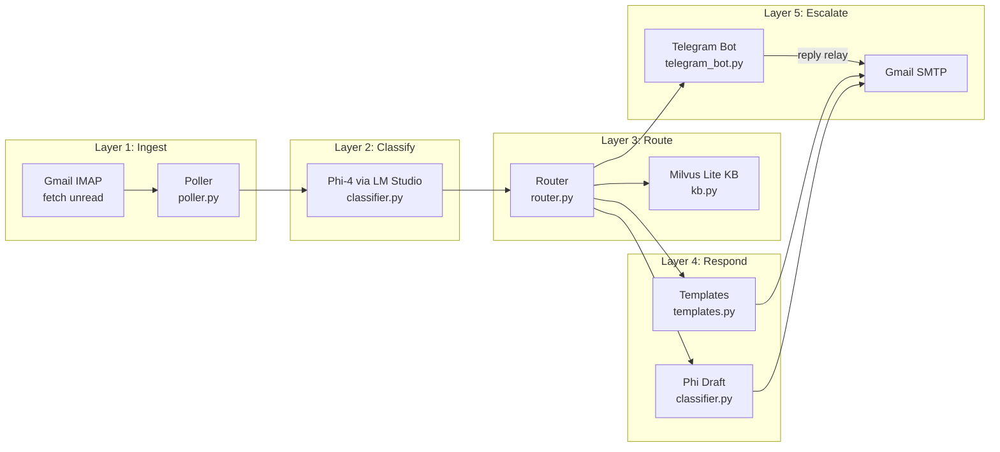
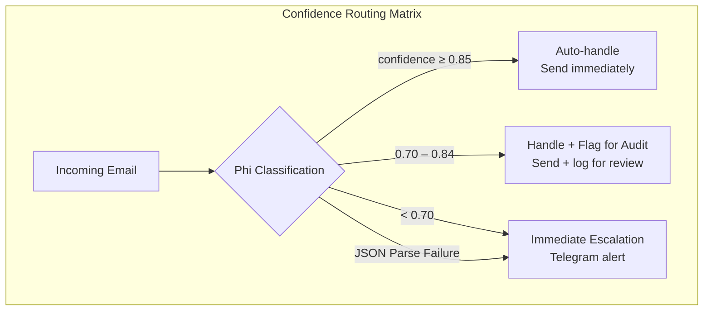
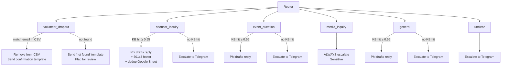
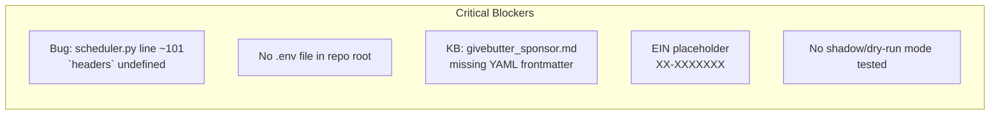

# Email Monitor — Current State

> **Last updated:** 2026-06-09  
> **Location:** `Fundraising/mail_service/email_monitor/`  
> **Run with:** `cd mail_service && python -m email_monitor.main`

---

## Quick Architecture Overview





---

## What's Fully Implemented ✅

### Core Pipeline (100% coded)

| Module | File | Status | Notes |
|--------|------|--------|-------|
| Entry point | `main.py` | ✅ Done | APScheduler + Telegram, graceful shutdown with signals |
| Config | `config.py` | ✅ Done | All env vars, `.env` loading, HF_HOME setup |
| Auth | `auth.py` | ✅ Done | Gmail IMAP + SMTP with app password |
| Poller | `poller.py` | ✅ Done | IMAP fetch unread, text extraction, dedup via SQLite |
| Classifier | `classifier.py` | ✅ Done | Phi-4 via LM Studio, classification JSON + draft mode |
| Router | `router.py` | ✅ Done | 6 intent handlers, confidence routing, escalation |
| Composer | `composer.py` | ✅ Done | SMTP send bridge |
| Templates | `templates.py` | ✅ Done | Dropout confirmation, not-found, 501(c)(3) footer |
| Scheduler | `scheduler.py` | ✅ Done | APScheduler cron, sponsorship Google Sheets dedup |
| Telegram Bot | `telegram_bot.py` | ✅ Done | Escalation alerts + reply-to-email relay |

### Data Layer (100% coded)

| Module | File | Status | Notes |
|--------|------|--------|-------|
| Thread State | `db.py` | ✅ Done | SQLite WAL, `threads` + `response_log` tables, JSON history |
| Knowledge Base | `kb.py` | ✅ Done | Milvus Lite embedded, all-MiniLM-L6-v2, hash-based reindex |
| Google Sheets | `sheets.py` | ✅ Done | Row deletion by email in Nonprofits sheet |

### KB Documents (6 files)

| File | Status | Content |
|------|--------|---------|
| `volunteer.md` | ✅ Done | Volunteer roles, registration, code of conduct |
| `sponsorship.md` | ✅ Done | 4 tiers (Platinum $5K → Bronze $500) |
| `logistics.md` | ✅ Done | Venue, parking, meals, tech stack |
| `nonprofit_status.md` | ✅ Done | 501(c)(3), EIN placeholder, tax deductibility |
| `general.md` | ✅ Done | What is GiveCamp, how to apply, projects |
| `givebutter_sponsor.md` | ✅ Done | GiveButter campaign copy (no frontmatter — may not index correctly) |

---

## Key Architecture Decisions (Deviations from Original PRD)

| PRD Specified | Actually Implemented | Why |
|---------------|---------------------|-----|
| MS Graph API + MSAL | **Gmail IMAP/SMTP** | Simpler; no OAuth token refresh needed; just app password |
| Ollama (Phi-3-mini) | **llama.cpp server + Qwen 3.5-35B** (OpenAI-compatible API on port 8080) | Same server as FormFillerouter; single model for both projects |
| Milvus Docker | **Milvus Lite** (embedded, file-based) | No Docker needed; zero ops overhead |
| Phi-3-mini / 3.5 | **Qwen 3.5-35B** (via llama.cpp server) | Same model used by FormFillerouter |

---

## Intent Handler Summary



---

## `.env` Requirements

The app reads from the **repo root** `.env` (not from `mail_service/`). These are the critical vars:

```bash
# ── REQUIRED ──
GMAIL_EMAIL="your-email@gmail.com"
GMAIL_APP_PASSWORD="your-16-char-app-password"

# ── REQUIRED for auto-reply ──
LLM_BASE_URL="http://localhost:8080/v1"    # llama.cpp server (shared with FormFillerouter)
LLM_MODEL="qwen3.5-35b-a3b"

# ── REQUIRED for escalation alerts ──
TELEGRAM_BOT_TOKEN="123:abc..."
TELEGRAM_CHAT_ID="123456789"

# ── Optional (has defaults) ──
POLL_INTERVAL_MINUTES=60
CONFIDENCE_THRESHOLD_AUTO=0.85
CONFIDENCE_THRESHOLD_REVIEW=0.70

# ── Sponsorship Google Sheet dedup ──
SPONSOR_SHEET_URL="https://docs.google.com/spreadsheets/d/..."
SPONSOR_SHEET_NAME="Nonprofits"
SPONSOR_SERVICE_ACCOUNT_FILE="GMailer/seattlegivecamp-1373-0bf9a18afc34.json"
SPONSOR_EMAIL_SUBJECT="Support Seattle GiveCamp – October 17th Weekend"
```

You already have an `.env.sponsor` file at `GMailer/.env.sponsor` with the Google Sheets and Gmail credentials — the email_monitor needs those same values in the repo root `.env`.

---

## What's NOT Done / Needs Work Before Production 🚧

### 🔴 Critical (blockers)



1. **🐛 Bug in `scheduler.py`** — Line ~101: `self._process_message(headers, msg)` — the `headers` variable is undefined. This will crash at runtime. The signature should just be `self._process_message(msg)`.

2. **No `.env` file exists** — The repo root needs a `.env` file. Copy relevant values from `GMailer/.env.sponsor`.

3. **`givebutter_sponsor.md` missing frontmatter** — It starts with `# Seattle GiveCamp...` instead of `---\ntitle: ...\n---`. It won't be properly indexed by the KB manager.

4. **EIN is placeholder** — `templates.py` line: `EIN: XX-XXXXXXX`. Need real EIN before sending to sponsors.

5. **Shadow mode not tested** — `composer.py` mentions `SAVE_OUTPUTS_ONLY` env var but it's not implemented — the check doesn't exist in the code path.

### 🟡 Important (should do before launch)

6. **No test suite** — Zero tests exist. At minimum need: classifier JSON parsing tests, router decision matrix tests, template rendering tests.

7. **No health check** — PRD §10 specifies Telegram health check ping every 15 min; not implemented. If Telegram goes down, escalations silently fail.

8. **No log rotation** — PRD §6 specifies structured JSON logs rotated daily, retained 90 days. Only stdout logging exists.

9. **Volunteer CSV path** — Default points to `mail_service/data/volunteers.csv`. Need to verify the CSV is at that path with the right columns.

10. **KB similarity threshold** — Set to `0.55` for `all-MiniLM-L6-v2`. This is quite low. PRD originally specified `0.72`. Needs validation with real queries.

### 🟢 Nice-to-have (post-launch)

11. **Fallback to email-to-self** — PRD §10: if Telegram unreachable, fallback to emailing the owner. Not implemented.
12. **GiveButter API integration** — Syncing volunteer roster from GiveButter instead of manual CSV.
13. **SQLite backup automation** — Daily backup of `thread_store.db`.
14. **Dashboard / status page** — No visibility into thread states without querying SQLite directly.

---

## How to Start Developing Again

### 1. Prerequisites

```bash
# Activate the virtualenv
source /home/microshak/Source/SeattleGiveCamp/.venv/bin/activate

# Install deps
cd /home/microshak/Source/SeattleGiveCamp/Fundraising/mail_service
pip install -r requirements.txt
```

### 2. Start llama-server

Run `FormFillerouter/llm.sh` which starts the Qwen model on `http://localhost:8080` with OpenAI-compatible API:

```bash
cd /home/microshak/Source/SeattleGiveCamp/FormFillerouter
bash llm.sh
```

The email_monitor shares this same server.

### 3. Create `.env` in repo root

Copy values from `GMailer/.env.sponsor` to `/home/microshak/Source/SeattleGiveCamp/.env`.

### 4. Run

```bash
cd /home/microshak/Source/SeattleGiveCamp/Fundraising/mail_service
python -m email_monitor.main
```

### 5. Current run modes

| Mode | How |
|------|-----|
| Full live | `python -m email_monitor.main` (will send real emails!) |
| Dry-run / shadow | **Not yet implemented** — you'd need to add the check in `composer.py` |
| Test single email | Import `classifier.classify()` and `router.route()` manually |

---

## File Map

```
Fundraising/
├── kb/                              # Knowledge base markdown files
│   ├── general.md                   # ✅
│   ├── givebutter_sponsor.md        # ⚠️ Missing YAML frontmatter
│   ├── logistics.md                 # ✅
│   ├── nonprofit_status.md          # ✅ (EIN placeholder)
│   ├── sponsorship.md               # ✅
│   └── volunteer.md                 # ✅
│
├── mail_service/
│   ├── requirements.txt
│   ├── data/
│   │   └── volunteers.csv           # Need to verify this exists
│   │
│   └── email_monitor/
│       ├── __init__.py              # Config import guard
│       ├── main.py                  # Entry point ✅
│       ├── config.py                # All settings ✅
│       ├── auth.py                  # Gmail IMAP/SMTP ✅
│       ├── poller.py                # IMAP fetch + SMTP send ✅
│       ├── classifier.py            # Phi-4 classify + draft ✅
│       ├── router.py                # Intent routing + escalation ✅
│       ├── composer.py              # Send bridge ✅
│       ├── templates.py             # HTML templates ✅
│       ├── db.py                    # SQLite thread + audit ✅
│       ├── kb.py                    # Milvus Lite KB ✅
│       ├── scheduler.py             # APScheduler + dedup ✅ (has bug)
│       ├── sheets.py                # Google Sheets dedup ✅
│       ├── telegram_bot.py          # Escalation + relay ✅
│       ├── kb_hashes.json           # KB change detection
│       ├── milvus_lite.db/          # Vector DB data
│       └── thread_store.db          # SQLite thread state
│
└── docs/prd/
    └── emaileragent.md              # Original PRD (reference)
```

---

## Quick-Start Checklist to Production

```
□  Fix scheduler.py bug (undefined `headers` variable)
□  Create .env file in repo root with Gmail + LM Studio + Telegram vars
□  Fix givebutter_sponsor.md — add YAML frontmatter
□  Get real EIN and update templates.py
□  Implement SAVE_OUTPUTS_ONLY shadow mode
□  Verify volunteers.csv exists at expected path
□  Tune KB similarity threshold with real queries
□  Add Telegram health check ping
□  Add log rotation
□  Write at least 3 classifier tests (parse success, parse failure, edge case)
□  Dry run for 1 week in shadow mode
□  Review escalation rate and KB gaps
□  Launch
```
